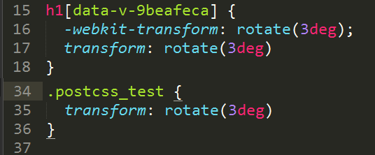

## 基于vue-cli搭建一个多页面应用(二)--postcss插件和css预编译配置

##### 这里以原项目模板的postcss插件autoprefixer为例说明：  


1.为了便于测试，对首页做一些调整：  
增加index.css
```
.postcss_test {
    transform: rotate(3deg);
}
```

修改index.js
```
import './index.css'

//屏蔽掉template属性
new Vue({
  el: '#app',
  router,
  // template: '<App/>',
  components: { App }
})
```

修改index.html
```
<div id="app">
    <app></app>
    <h1 class="postcss_test">postcss-autoprefixer</h1>
</div>
```

2.便于对比，对Hello.vue添加样式
```
<style scoped>
......
h1 {
  transform: rotate(3deg);
}
......
</style>
```

3.分别启动项目查看样式对比和打包后样式对比：  

  
可以看出原模板的postcss插件只对组件起作用，不对页面起作用

4.安装postcss-loader并修改build/utils.js的配置
```
$ npm install postcss-loader -D
```

```
  function generateLoaders (loader, loaderOptions) {
    var loaders = [cssLoader]
    if (loader) {
      ......
      loaders.splice((loaders.length - 1), 0, 'postcss-loader')
    }else {
      loaders.push('postcss-loader')
    }
    ......
  }
```

PS：2017.07.30补充
================= start ==================
以上配置时postcss-loader的版本为1.3.3
若postcss-loader的版本为2.0.0-2.0.2，以上配置会报错  
> Module build failed: TypeError: Cannot create property 'prev' on boolean 'false'
at Promise.resolve.then.then  

2.0.3及以上版本要报warning：  
> Previous source map found, but options.sourceMap isn't set.
In this case the loader will discard the source map enterily for performance reasons.
See https://github.com/postcss/postcss-loader#sourcemap for more information  

2.0.3及以上版本需重新配置：
```
  function generateLoaders (loader, loaderOptions) {
    var loaders = [cssLoader]
    var postcssLoader = {
      loader:  'postcss-loader',
      options: {
        sourceMap: true
      }
    }
    if (loader) {
      ......
      loaders.splice((loaders.length - 1), 0, postcssLoader)
    }else {
      loaders.push(postcssLoader)
    }
    ......
  }
```
================= end ==================

5.如果需要用到css的预编译，这里以sass为例，安装相应的插件即可：  
```
$ npm install sass-loader node-sass -D
```

6.把index.css改为index.scss并用sass语法写样式，同时修改Hello.vue如下：  
在style标签上添加：lang="scss"
```
<style scoped lang="scss">
......
.hello {
  h1 {
    transform: rotate(3deg);
  }
}
......
</style>
```

7.涉及到vue组件的设置，请参考文档：[vue-loader](http://vue-loader.vuejs.org/en/)，[中文文档]()正在翻译中，敬请期待

2017.03.21补充：感谢[Wall](https://github.com/WangQiangrong)的提醒  
上面关于style的lang属性，如果使用sass语法，也可以lang="sass"  
在官方文档帮助手册里面说明了这个问题：
```
lang="scss" corresponds to the CSS-superset syntax (with curly braces and semicolones).
lang="sass" corresponds to the indentation-based syntax
```
关于sass和scss格式的区别，可参考[官方文档](http://sass-lang.com/documentation/file.SASS_REFERENCE.html#syntax)


> 本系列文章：

1. <a href="https://github.com/tonyfree/blog/issues/1" target="_blank">基础结构的搭建</a>
2. <a href="https://github.com/tonyfree/blog/issues/2" target="_blank">postcss插件和css预编译配置</a>
3. <a href="https://github.com/tonyfree/blog/issues/3" target="_blank">路径别名和模块自动加载配置</a>
4. <a href="https://github.com/tonyfree/blog/issues/4" target="_blank">rap自动切换配置</a>
5. <a href="https://github.com/tonyfree/blog/issues/5" target="_blank">自动化部署</a>
6. <a href="https://github.com/tonyfree/blog/issues/6" target="_blank">移动端适配方案</a>
7. <a href="https://github.com/tonyfree/blog/issues/7" target="_blank">UI库的选择和使用</a>
8. <a href="https://github.com/tonyfree/blog/issues/8" target="_blank">移动调试和异常监控</a>