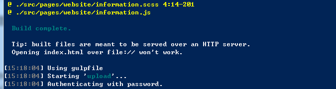

## 自动化部署

打包测试或者上线发布，都需要把打包好的代码上传到服务器，重复手动的事情都可以通过代码来解决。

本文以gulp为例，根据不同的协议选用不同的插件：SFTP--[gulp-sftp](https://github.com/gtg092x/gulp-sftp)、FTP--[vinyl-ftp](https://github.com/morris/vinyl-ftp)，下面以SFTP协议来配置

1.安装相应的插件
```
$ npm install gulp -g
$ npm install gulp gulp-sftp -D
```


2.在项目根目录下的project.config.js中添加配置：
```
var sftpConfig = {
  host: 'https://github.com/tonyfree',
  port: 22,
  user: 'tony',
  pass: '123',
  remotePath: '/opt/html/projectName'
}

module.exports = {
  ......
  sftpConfig: sftpConfig
}

```

3.在项目根目录下创建gulpfile.js
```
var gulp = require('gulp')
var sftp = require('gulp-sftp')
var sftpConfig = require('./project.config.js').sftpConfig

gulp.task('upload', function() {
  return gulp.src('dist/**')
    .pipe(sftp(sftpConfig))
})
```

4.在package.json中配置scripts：
```
  "scripts": {
    ......
    "build-only": "node build/build.js"
    "build": "node build/build.js && gulp upload",
    "upload": "gulp upload"
  },
```

5.执行如下命令后,会先打包然后上传到服务器
```
$ npm run build
```


6.上面上传到服务器一般都是内部测试，如果需要发布到正式环境要把dist文件夹发给运维人员，使用[node-archiver](https://github.com/archiverjs/node-archiver)插件把dist文件夹压缩成zip文件  
build/zip.js
```
var fs = require('fs')
var archiver = require('archiver')
var output = fs.createWriteStream(require('path').join(__dirname,'../') + '/haotaitai.zip')
var archive = archiver('zip', {
    zlib: { level: 9 } // Sets the compression level.
})

archive.pipe(output)

archive.directory(require('path').join(__dirname,'../dist/'))

archive.finalize()
```

7.修改script命令：
```
  "scripts": {
    ......
    "build-publish": "node build/build.js && node build/zip.js"
  },
```

> 本系列文章：

+ <a href="multi-page-app-01.md" target="_blank">基础结构的搭建</a>
+ <a href="multi-page-app-02.md" target="_blank">postcss插件和css预编译配置</a>
+ <a href="multi-page-app-03.md" target="_blank">路径别名和模块自动加载配置</a>
+ <a href="multi-page-app-04.md" target="_blank">rap自动切换配置</a>
+ <a href="" target="_blank">移动端适配方案</a>
+ <a href="" target="_blank">UI库的选择和使用</a>