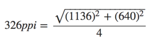
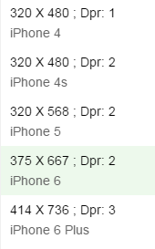
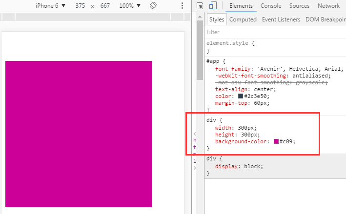
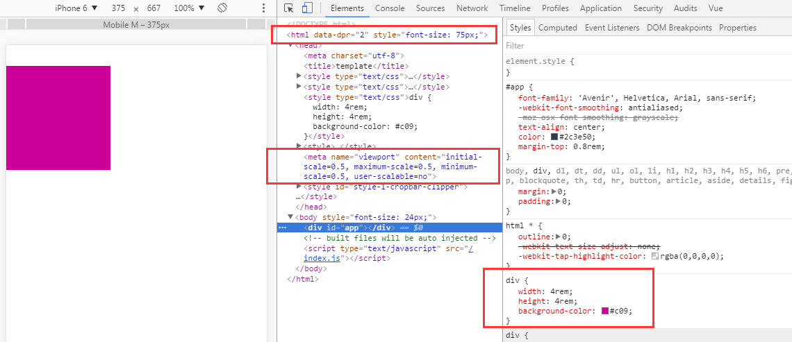

## 移动端适配方案

##### 要做移动端的适配方案，要先弄清楚一些概念：  

+ 视窗viewport：visualviewport和layoutviewport，参考[PPK的教程](http://www.quirksmode.org/mobile/viewports2.html)、对应的[中文翻译](http://www.w3cplus.com/css/viewports.html)
+ 物理像素：即分辨率，如iPhone6的分辨率为750pt * 1334pt
+ 独立设备像素：即屏幕尺寸，如iPhone6的屏幕尺寸为375pt * 667pt
+ css像素
+ 屏幕密度：以iPhone5为例  
  
关于不同设备的分辨率、屏幕尺寸和ppi，可查看[这里](https://www.sven.de/dpi/)
+ 设备像素比：简称dpr，可以通过window.devicePixelRatio获取到当前设备的dpr  
```
设备像素比 ＝ 物理像素 / 设备独立像素
```
iPhone系列的设备像素和dpr：      


##### 适配方案
+ 固定高度，宽度自适应：百分比，flex
+ 固定宽度，viewport缩放
+ rem做宽度，viewport缩放


在局部布局中可以采用第一个方案，比如底部导航栏就可以使用flex布局  
第二个方案在实际使用中遇到如下问题：1.地图在高清屏幕上变的模糊  2.在高清大屏上字体被同比放大，而不是显示更多(即无法实现在不同屏幕上字体大小统一)  
这里以第三个方案为例，采用阿里的flexible，原文点击这里：[使用Flexible实现手淘H5页面的终端适配](https://github.com/amfe/article/issues/17)  
源码和生产环境的代码地址分别为：[src](https://github.com/amfe/lib-flexible/blob/master/src/flexible.js)、[build](https://github.com/amfe/lib-flexible/blob/master/build/flexible.js)

##### flexible
1.将flexible.js文件复制到src/modules/js下  
2.安装postcss插件：[postcss-px2rem](https://www.npmjs.com/package/postcss-px2rem)
```
$ npm install postcss-px2rem -D
```
3.在.postcssrc.js中添加如下配置：
```
module.exports = {
  "plugins": {
    // to edit target browsers: use "browserlist" field in package.json
    "autoprefixer": {},
    "postcss-px2rem": {
      remUnit: 75
    }
  }
}
```

4.写点简单的代码,假设设计稿为750

index.html
```
  <body>
    <div id="app">
    </div>
  </body>
```
index.scss
```
div {
    width: 300px;
    height:300px;
    background-color: #c09;
}
```
index.js
```
import './index.scss'
```
先看没有配置在.postcssrc.js的效果：这就是pc上的效果


接下来是配置.postcssrc.js的效果：被缩小了4倍


最后在index.js中引入适配方案：
```
require('js/flexible.js')
```


ok，这才是我们想要的效果，这里我们并没有在index.html的head中添加&lt;meta name="viewport">标签，上图中间红色方框部分都是flexible.js自动计算添加的。

最后一个问题，flexible.js默认字体在所有设备上都是统一大小，如果你想让字体根据设备不同进行适配，直接写rem单位就好，如果使用sublime可用[cssrem](https://github.com/flashlizi/cssrem)这个插件将px转化为rem(只需要处理一定要写成rem的部分，其他正常用px，postcss-px2rem会自动转换)

> 本系列文章：

1. <a href="https://github.com/tonyfree/blog/issues/1" target="_blank">基础结构的搭建</a>
2. <a href="https://github.com/tonyfree/blog/issues/2" target="_blank">postcss插件和css预编译配置</a>
3. <a href="https://github.com/tonyfree/blog/issues/3" target="_blank">路径别名和模块自动加载配置</a>
4. <a href="https://github.com/tonyfree/blog/issues/4" target="_blank">rap自动切换配置</a>
5. <a href="https://github.com/tonyfree/blog/issues/5" target="_blank">自动化部署</a>
6. <a href="https://github.com/tonyfree/blog/issues/6" target="_blank">移动端适配方案</a>
7. <a href="https://github.com/tonyfree/blog/issues/7" target="_blank">UI库的选择和使用</a>
8. <a href="https://github.com/tonyfree/blog/issues/8" target="_blank">移动调试和异常监控</a>