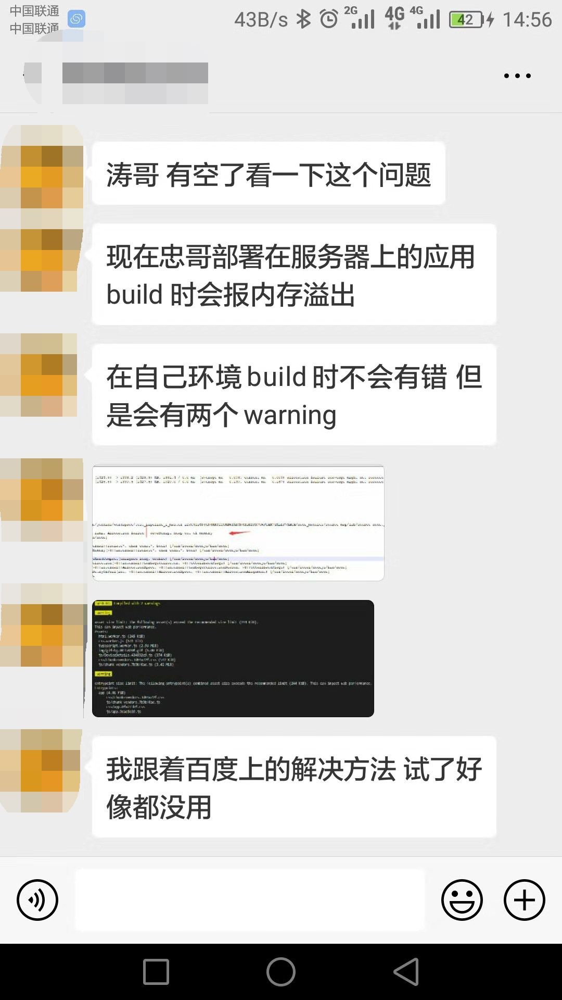
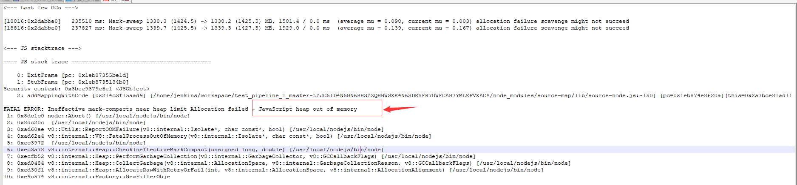
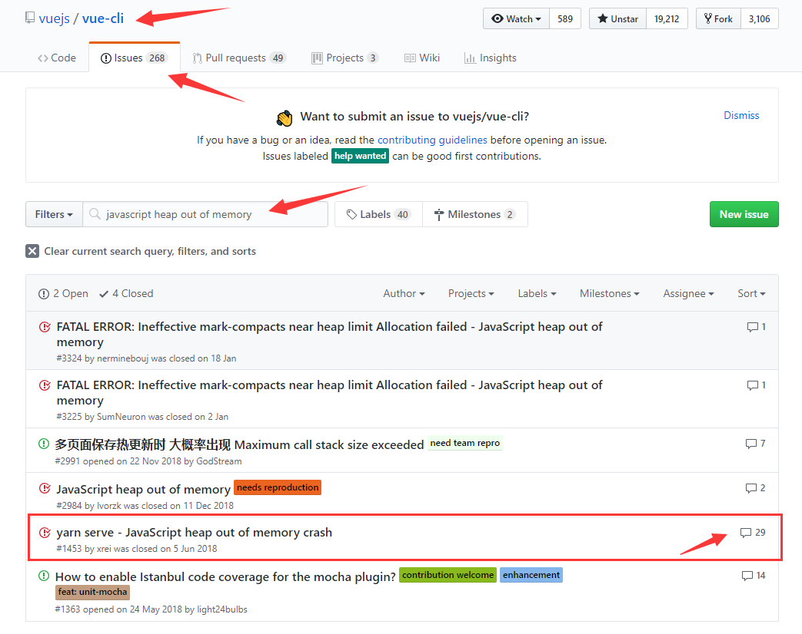
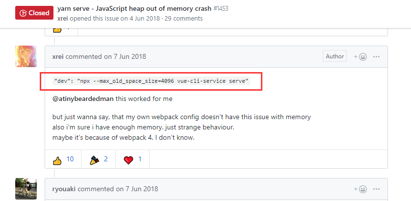

事情的起因是这样的:



> 背景：开发方式为前后端分离，git+Jenkins自动化部署，前端采用vue-cli脚手架打包

可以看到两个问题都是打包部署时引起的：1.服务器自动部署打包时内存溢出；2.本地打包时两个警告。

我们这里只谈内存溢出，两个警告属于打包优化，暂不讨论。



图中小伙伴已经标出了异常提示：
```
javascript heap out of memory
```
我们来百度一下：


从第一篇文章我们可以得到如下答案：
> node基于v8引擎，v8存在内存限制：64位为1.4GB，32位为0.7GB，如果程序在执行过程中超过这个限制就容易崩溃，可以通过配置max_old_space_size来放宽这个限制
```
node --max_old_space_size=4096 build/build.j
```
但是文章中的打包是通过node命令直接执行的，而我们是使用vue-cli脚手架的vue-cli-service命令来执行的
```
vue-cli-service build
```
虽然弄清楚了原理，但是没有找到合适的解决方案，现在我们应该到vue-cli原项目下的Issues中寻找答案：

首先看答复最多的，你想要的解决方案往往就在这里：

最后的解决方案：把package.json下的build命令做如下修改即可
```
"build": "npx --max_old_space_size=8192 vue-cli-service build"
```
遗留和扩展：  
1.撰写此文时，没有检验最后的效果，请王同学跟进反馈  
2.如果你不知道什么是npx请自行查阅  
3.当你使用开源产品的时候，出了问题要习惯到其Issue下搜索  
4.不知道你用百度的时候，有没有看到下面这行字，即使如此我还是建议你学会使用google
<p>您可以仅查看：<span style="color:blue;">英文结果</span></p>
5.<a href="https://segmentfault.com/a/1190000000440270">浅谈V8引擎中的垃圾回收机制</a>
